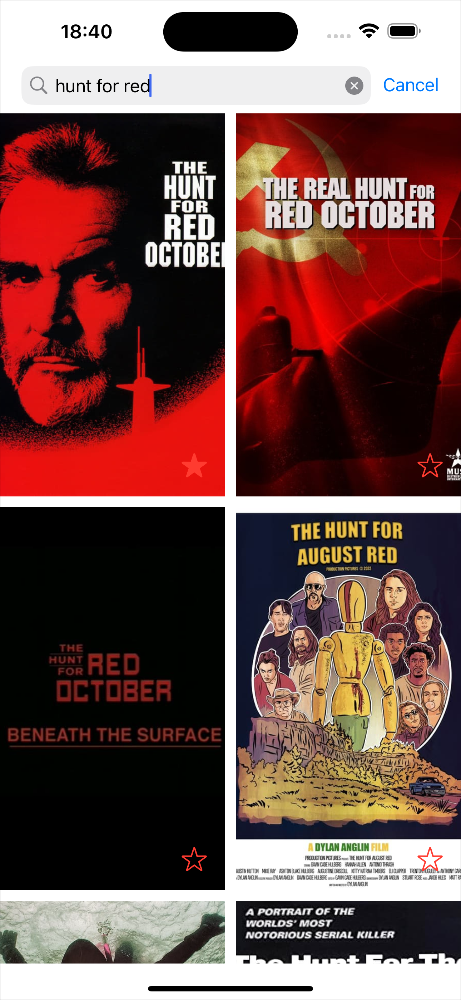
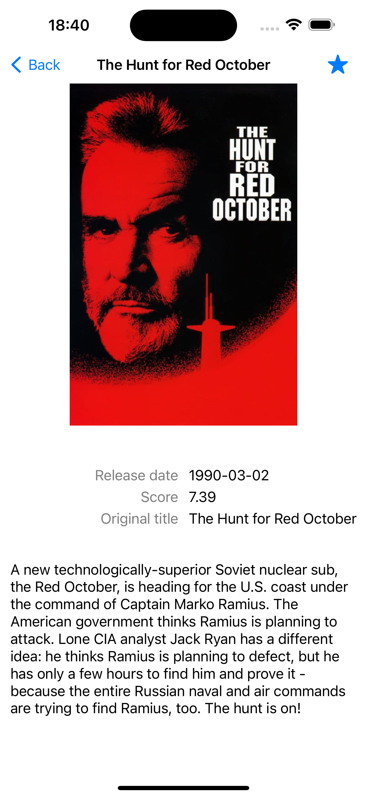
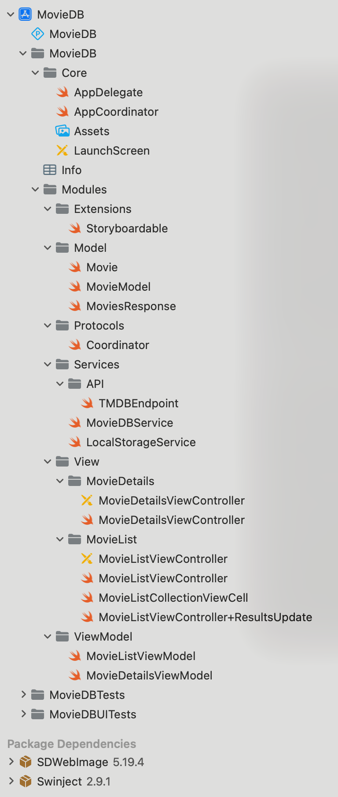
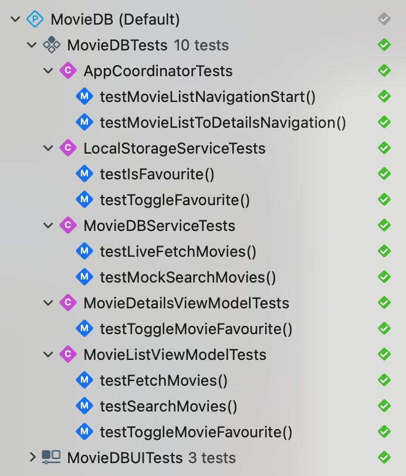

# MovieDB
Now playing movies and search sample app using MVVM-C (with coordinators) and async/await structured concurrency. 

The app consist of two screens. The main screen shows list of now playing movies with ability to search for any title. 
The second screen shows selected movie details.

The app connects to the rest api to get the list of movies and search for titles.

Jump to

- [Screenshots](#screenshots)
- [Project structure](#project-structure)
- [Tests](#tests)
- [Future work](#future-work)

## Screenshots 

&nbsp;
 

&nbsp; 

## Project structure

<table style="border-collapse: collapse; ">
<tr>
<td style="vertical-align: top;">

</td>
<td style="vertical-align: top;">
Project has 2 main groups: Core and Modules. 
App contains main app views along with master detail navigation defined.  
Modules group contains implementation of movie list, movie details, view models and services. 
Potentially, Modules could be moved to separate packages if needed. 
 
Look inside the code for particular file comment.
</td>
</tr>
</table>

[back to top](#readme)

## Tests

<table style="border-collapse: collapse; ">
<tr>
<td style="vertical-align: top;">

</td>
<td style="vertical-align: top;">
Project contains unit tests for view models and also for api service live/mock. 
Live api service test is done for demo purposes only. The app shouldn't test live api service.
 
</td>
</tr>
</table>

[back to top](#readme)

## Future work
Potential future work/discussion/questions:

- Movie details could be loaded with additional call on details screen
- Any errors could present messages to the user
- Search bar could show autocomplete titles however the main list shows filtered search results instead?

[back to top](#readme)